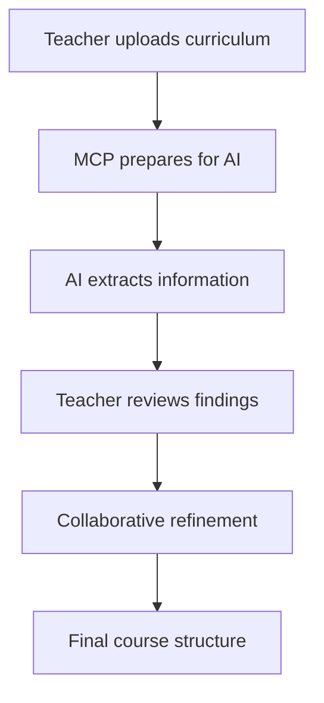

# AI Integration in COSEAQ-C

## How AI Powers the Curriculum Analysis

### The Problem with Manual Analysis
- Reading 50+ pages of curriculum documents
- Identifying all competencies, objectives, and requirements
- Ensuring nothing is missed
- Creating logical course structure
- Time-consuming and error-prone

### The COSEAQ-C AI Solution



## AI Analysis Process

### 1. Document Access
The MCP server can access files directly from your computer:

```typescript
// Teacher grants access to curriculum files
@coseaq-c: "I need to read your curriculum file at /Documents/Biology-Curriculum.pdf"
Teacher: [Approves access]
MCP: Reads file and prepares for AI analysis
```

No uploading needed - just point to files on your computer!

### 2. Structured Extraction
AI analyzes documents to extract:
- **Competencies**: What students should be able to do
- **Objectives**: Specific learning goals
- **Topics**: Content areas and their relationships
- **Assessment**: How learning is evaluated

### 3. Intelligent Questions
Based on analysis, AI generates questions like:
- "Which competencies are most critical for your students?"
- "How should we sequence these topics?"
- "What local examples would work best?"

### 4. Collaborative Refinement
Teacher feedback directly shapes the analysis:

```
Teacher: "Add more practical lab work"
AI: Updates structure to emphasize hands-on activities

Teacher: "Students struggle with abstract concepts"  
AI: Suggests concrete examples and gradual progression
```

## Why AI + Teacher > AI Alone

**AI Strengths:**
- Process large documents quickly
- Find all connections and requirements
- Suggest logical structures
- Never miss details

**Teacher Strengths:**
- Know their students
- Understand local context
- Make pedagogical decisions
- Ensure practical feasibility

**Together = Perfect Curriculum**

## Implementation Details

### AI Prompts Structure
Located in `ai-prompts.ts`:
- Extraction prompts (competencies, objectives, etc.)
- Analysis prompts (relationships, progression)
- Dialogue prompts (questions, adaptations)

### Session Management
The system maintains context:
- Previous decisions influence suggestions
- Teacher preferences are remembered
- Iterative refinement is supported

### Example AI Response Flow

```json
// 1. AI extracts competencies
{
  "keyCompetencies": [
    "Analyze biological systems and their interactions",
    "Design and conduct scientific investigations",
    "Evaluate evidence and draw conclusions"
  ]
}

// 2. Teacher provides feedback
"Focus more on practical lab skills"

// 3. AI adjusts analysis
{
  "keyCompetencies": [
    "Design and conduct laboratory experiments",
    "Use scientific equipment safely and effectively",
    "Collect and analyze experimental data"
  ]
}
```

## Best Practices

1. **Upload Complete Documents**: Both syllabus and national curriculum
2. **Be Specific in Feedback**: "Add ecology" → "Add 2 weeks on local ecosystems"
3. **Iterate Multiple Times**: First draft is rarely perfect
4. **Save Progress Regularly**: Use save_session after major decisions

## Future AI Enhancements

- **Multimodal Analysis**: Process images and diagrams
- **Cross-curricular Connections**: Find links between subjects
- **Adaptive Questioning**: Learn teacher's style over time
- **Automatic Updates**: Alert when curriculum changes